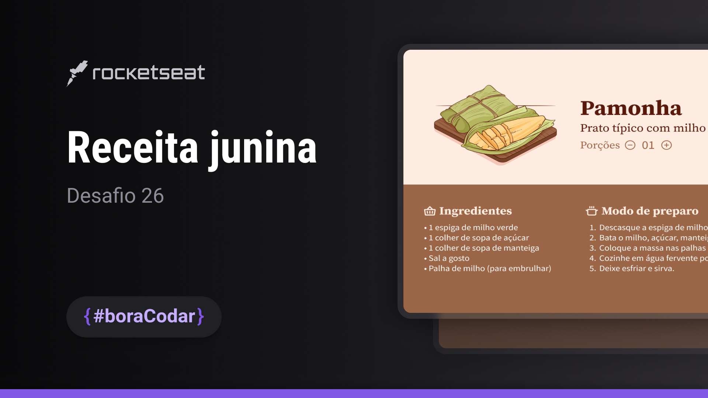

<strong><h1 align="center">#boraCodar - Desafio 26</h1></strong>

  

## 🚀 Tecnologias

Esse projeto foi desenvolvido com as seguintes tecnologias:

- HTML
- CSS
- JavaScript

---

Feito com ♥ by [Israel Batista](https://israelbatista.vercel.app)
